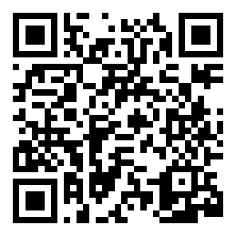
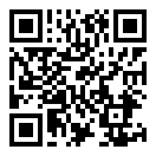

# SonoForm downloads

Official distributions of SonoForm, the documentation assistant for ultrasound physicians: https://getsonoform.com
Dictate the exam, get the protocol. Documentation assistant without diagnostic functions: every value is checked and confirmed by the physician.

This repository contains distributions only (APK files, checksums, release notes). There is no source code here.

## Latest version: 1.0.6 (build 7)

### SonoForm (international, getsonoform.com)

- Download APK: [sonoform-1.0.6.apk](https://github.com/anoviul/getsonoform_public/raw/main/releases/android/sonoform-1.0.6.apk)
- SHA-256: `8bbe745dc4e06f542b908e3f7cd027f46615ff77b06eb2a3e52349f0c1e730b8`
- Always the latest version: https://app.getsonoform.com/download/android

### УЗИ голосом (Россия, uzigolosom.ru)

- Скачать APK: [uzigolosom-1.0.6.apk](https://github.com/anoviul/getsonoform_public/raw/main/releases/android/uzigolosom-1.0.6.apk)
- SHA-256: `7a1dbe77d695d0b9f03ddeb86f7dd50df28fed6efa434d86cc70e73538c41ae8`
- Всегда последняя версия: https://app.uzigolosom.ru/download/android

### Install

1. Open the link or scan the QR code on the phone and download the APK.
2. Allow installation from this source when Android asks (Settings → Install unknown apps).
3. Open the app and sign in with the email you use for your account: a 6-digit code arrives by email. No password, no card.
4. Android 8.0 (API 26) or newer. Permissions: microphone (dictation), notifications (processing results).

The app checks for new versions itself and offers to download them. Verify the file with the SHA-256 checksum from `releases/CHECKSUMS.txt`.

## Release notes

## 1.0.6 (build 7) - 2026-09-15

- Sign in / sign up screen; more reliable saving of result edits.

## 1.0.6 (сборка 7) - 2026-09-15

- Экран «Вход / регистрация»; надежнее сохранение правок результата.

## 1.0.5 (build 6) - 2026-09-15

- The web account opens from the app without entering a code.
- Result parameters are collapsed by default; tap a row to select it and move it up or down.

## 1.0.5 (сборка 6) - 2026-09-15

- Личный кабинет открывается из приложения без ввода кода.
- Показатели результата свернуты по умолчанию; нажмите на строку, чтобы выделить ее и переместить вверх или вниз.

## 1.0.4 (build 5) - 2026-09-15

- Exam parameters in a collapsible block, 10 ultrasound exam types, physician from the directory.
- Simpler dictation: one record / pause button and a finish button, playback of audio recordings.
- Result: PDF and Word in table and text variants, editing of parameters and impression right in the app.

## 1.0.4 (сборка 5) - 2026-09-15

- Параметры проведения УЗИ в сворачиваемом блоке, 10 видов УЗИ, врач из справочника.
- Проще диктовка: одна кнопка записи / паузы и кнопка завершения, прослушивание аудиозаписей.
- Результат: PDF и Word в табличном и текстовом вариантах, правка показателей и заключения прямо в приложении.

## 1.0.3 (build 4) - 2026-09-12

- Reliability improvements.

## 1.0.3 (сборка 4) - 2026-09-12

- Повышение надежности.

## 1.0.2 (build 3) - 2026-09-12

- Reliability improvements.

## 1.0.2 (сборка 3) - 2026-09-12

- Повышение надежности.

## 1.0.1 (build 2) - 2026-09-12

- Cost estimate before sending, update check.

## 1.0.1 (сборка 2) - 2026-09-12

- Оценка стоимости до отправки, проверка обновлений.

## 1.0.0 (build 1) - 2026-09-12

- First release.

## 1.0.0 (сборка 1) - 2026-09-12

- Первый выпуск.

## Desktop

`releases/desktop/` - desktop workstation installers (not published yet).
